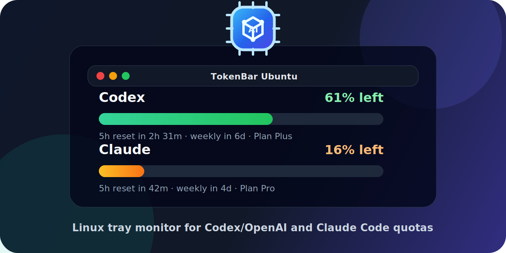

# TokenBar

<p align="center">
  
</p>

<p align="center">
  <strong>Ubuntu tray monitor for Codex/OpenAI and Claude Code quotas.</strong>
</p>

Linux-first fork/prototype inspired by [CodexBar](https://github.com/steipete/CodexBar), focused on **this machine setup** instead of broad cross-platform support.

## Officially supported

- **Ubuntu GNOME**
- **Wayland session**
- Local credentials already present for:
  - **Codex / OpenAI ChatGPT usage** via `~/.codex/auth.json`
  - **Claude Code usage** via `~/.claude/.credentials.json`
- Optional **OpenAI API** costs when `OPENAI_ADMIN_KEY` or `OPENAI_API_KEY` is exported

## Explicitly out of scope for this MVP

- macOS menu bar parity
- every Linux desktop environment
- 40+ providers from upstream CodexBar
- WidgetKit / Sparkle / macOS-only integrations

## What this repo contains

1. **TokenBar Linux tray app** in `tokenbar/`
2. Runnable launchers and installer helpers in `scripts/`
3. Focused Python tests in `tests/`
4. Final product spec: `docs/TOKENBAR_FINAL_SPEC.md`

The original CodexBar repository is used as the product inspiration/reference, but this repository intentionally contains only the Linux implementation needed for Ubuntu.

## Current Linux MVP behavior

- Reads real local Codex credentials from `~/.codex/auth.json`
- Calls the Codex/OpenAI usage endpoint documented by CodexBar
- Reads real local Claude credentials from `~/.claude/.credentials.json`
- Calls the Claude OAuth usage endpoint documented by CodexBar
- Optionally reads OpenAI API cost data from `OPENAI_ADMIN_KEY` / `OPENAI_API_KEY`
- Shows a compact Linux tray menu that prefers Ayatana AppIndicator and falls back only when needed
- Renders compact per-provider usage bars in the tray menu
- Shows refresh freshness (`updated X ago`), stale data state, and low-quota warning markers
- Refreshes automatically every 120 seconds by default
- Caches the latest provider snapshot locally so startup can show previous data immediately
- Sends configurable desktop notifications for low quota, provider errors, and stale data

## Run

```bash
./scripts/run_tokenbar.sh
```

Check whether the current session can host the tray:

```bash
./scripts/run_tokenbar.sh --check
```

Dump the current provider snapshot as JSON:

```bash
./scripts/run_tokenbar.sh --dump-json
```

Dump the last cached provider snapshot:

```bash
./scripts/run_tokenbar.sh --cache-dump
```

Dump the effective settings:

```bash
./scripts/run_tokenbar.sh --config-dump
```

Create the default settings file if it does not exist:

```bash
./scripts/run_tokenbar.sh --init-config
```

Run local diagnostics:

```bash
./scripts/run_tokenbar.sh --doctor
```

Notification controls:

```bash
./scripts/run_tokenbar.sh --clear-alerts
./scripts/run_tokenbar.sh --snooze-alerts-minutes 60
```

Update the user-level install from GitHub:

```bash
tokenbar --update-check
tokenbar --update-now
```

Start TokenBar automatically on login:

```bash
./scripts/run_tokenbar.sh --install-autostart
./scripts/run_tokenbar.sh --remove-autostart
```

Install recommended Ubuntu desktop dependencies, then install/uninstall into the current user's Ubuntu desktop paths:

```bash
sudo apt install gir1.2-gtk-3.0 gir1.2-ayatanaappindicator3-0.1 libayatana-appindicator3-1 zenity libnotify-bin
./scripts/run_tokenbar.sh --install-check
./scripts/install_tokenbar.sh
tokenbar --doctor
```

The installer writes only user-level files:

- `~/.local/share/tokenbar/app/` — installed app copy
- `~/.local/bin/tokenbar` — launcher
- `~/.local/share/applications/tokenbar.desktop` — desktop app entry
- `~/.local/share/icons/hicolor/scalable/apps/tokenbar.svg` — app icon

Uninstall keeps `~/.config/tokenbar` and `~/.cache/tokenbar` by default. To remove those too:

```bash
./scripts/run_tokenbar.sh --uninstall-user --purge-user-data
```

## Important implementation note

This MVP does **not** try to rebuild CodexBar's macOS Swift UI on Linux.
Instead, it reuses the **upstream provider/data-source approach** and adds a thin Linux tray shell that fits the current machine better.

## Where it should work well

Best expected environment:

- Ubuntu GNOME
- Wayland
- GTK 3 available
- Codex CLI already authenticated
- Claude Code already authenticated
- working outbound internet access

## Refresh and alert behavior

- Data refreshes automatically every 120 seconds by default.
- Manual refresh stays directly available from the tray menu.
- TokenBar avoids overlapping refreshes if a refresh is already running.
- The menu shows when data was last updated and marks stale data after about 15 minutes.
- Providers at or below 10% left are marked as low quota by default.
- The latest snapshot is saved to `~/.cache/tokenbar/latest-snapshot.json` after successful refreshes.
- On startup, cached data is shown immediately while the first live refresh runs.
- Desktop notifications are de-duplicated by active alert state to avoid spamming every refresh.
- Alert state can be cleared or snoozed from the Settings window or CLI.

## Minimal settings config

TokenBar reads an optional JSON config from:

```text
~/.config/tokenbar/config.json
```

Example:

```json
{
  "refresh_interval_seconds": 120,
  "stale_after_minutes": 15,
  "low_quota_threshold": 10,
  "providers": {
    "codex": true,
    "claude": true,
    "openai_api": false
  },
  "notifications": {
    "enabled": true,
    "low_quota": true,
    "provider_errors": true,
    "stale": true
  }
}
```

Notes:

- Missing config is fine; TokenBar uses the defaults above.
- Invalid config is ignored safely and reported by `--config-dump`.
- You can create the default file from the CLI with `./scripts/run_tokenbar.sh --init-config`.
- The tray menu keeps only provider status, **Refresh now**, **Settings…**, and **Quit**. The polished Settings window contains account, app, notification, and maintenance sections for config, auth, diagnostics, updates, and autostart actions.
- `codex` and `claude` are enabled by default.
- `openai_api` is disabled by default and only works when `OPENAI_ADMIN_KEY` or `OPENAI_API_KEY` is exported.
- Unknown provider keys are ignored for now so the MVP stays limited to Codex/OpenAI and Claude Code.
- Notifications use `notify-send` on Linux when available and keep anti-spam state in `~/.cache/tokenbar/alert-state.json`.

## Diagnostics and autostart

TokenBar includes a lightweight diagnostics command:

```bash
./scripts/run_tokenbar.sh --doctor
./scripts/run_tokenbar.sh --doctor-json
```

It reports tray/session hints, auth file presence, config/cache paths, notification tools, and autostart state.

Autostart is intentionally simple before packaging: `--install-autostart` writes a user-level desktop entry at:

```text
~/.config/autostart/tokenbar.desktop
```

Use `--remove-autostart` to remove it.

## Troubleshooting guidance

TokenBar classifies common provider failures and shows short recovery hints directly in the tray menu:

- Codex auth missing or expired → use **Settings… → Sign in to Codex**
- Claude auth missing or expired → use **Settings… → Sign in to Claude**
- Network/DNS failure → `Check internet connection`
- Temporary provider/API failures → try refreshing again later

The tray keeps raw technical details out of the main provider row so failures stay readable.

## Known limitations

- `Gtk.StatusIcon` is a pragmatic Linux MVP choice and may behave differently across desktops
- OpenAI “API costs” and Codex “ChatGPT/Codex subscription usage” are different sources
- The tray backend is selected automatically for Ubuntu sessions, preferring AppIndicator-compatible integration and using a custom AI-token chip-style TokenBar icon set
- If your desktop hides legacy tray icons, behavior may degrade

## Upstream reference

TokenBar is inspired by [CodexBar](https://github.com/steipete/CodexBar) and reuses the same product idea: compact visibility into AI provider quota/usage from the tray/menu bar. This Linux repository keeps the implementation intentionally small and Ubuntu-focused.

## Development direction

Near-term focus:

1. keep Linux support narrow and honest
2. validate the Codex + Claude flows on this machine
3. improve tray UX only after provider snapshots are stable
